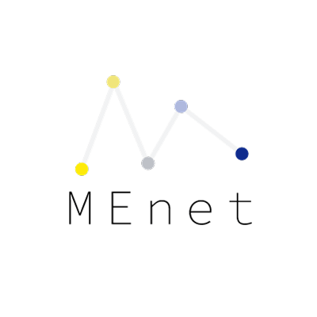

# MEnet 

MEnet is a neural-net based deconvolution method for methylation data. MEnet can be used only for humans so far.

## Installation

1. Install pytorch. [https://pytorch.org/get-started/locally/](https://pytorch.org/get-started/locally/)
2. git clone this repo.
3. `python setup.py install`
4. If you use the `--input_type bismark` option, you need to install `bedtools` locally.

## Prediction

```
usage: MEnet predict [-h] -i input -m model
                     [--input_type {auto,bismark,table,array}] [-o output_dir]
                     [--bedtools BEDTOOLS]

optional arguments:
  -h, --help            show this help message and exit
  -i input, --input input
                        input
  -m model, --model model
                        Traind model (pickle file).
  --input_type {auto,bismark,table,array}
                        input type. (default : auto)
  -o output_dir, --output_dir output_dir
                        output directory
  --bedtools BEDTOOLS   Full path to bedtools.
```

example

```
MEnet predict --input Minion_STR1_Fr6.bis.cov.gz --model ../train/210228_optuna_CV/best_model.pickle --input_type bismark  -o Minion_STR1_Fr6
```

## Output

`cell_proportion_MajorGroup.csv` and `cell_proportion_MinorGroup.csv` are infered cell proportions for Major categories and Minor categories.

```
Tissue,Minion_STR1_Fr6
Adipocytes,0.00017756927380603907
AdrenalGland,1.738096416975436e-05
Neuron,0.0006150502083486212
Skin,0.00013093999620681127
Muscle,1.2423588317326314e-05
Cardiovascular,9.538600816076434e-05
...
```

### heatmap

### barplot

### log

`MEnet.*.log` contains MEnet version and execution date.

## Training an original model(advanced usage)

Users can define and train models. Before training, users need to create the reference matrix, categories, and input yaml. Details are on the directory `create_ref`.

```
usage: MEnet train [-h] [--device DEVICE] input_yaml

positional arguments:
  input_yaml       input yaml file.

optional arguments:
  -h, --help       show this help message and exit
  --device DEVICE  device for pytorch. (ex. cpu, cuda)
```

input_yaml (example)

```
reference: test/train/ref_MinorGroup_1000bp_500regions_0.5diff.210228.csv
integrated: test/train/210228_integrated_1000bp.csv.gz
pickle: test/train/210228_df.pickle
ref_table: test/train/210228_ref_ordered.csv
category: test/train/210228_categories.csv
output_dir: test/train/210228_optuna_CV
n_splits: 5
fill: mean
n_epochs: 200000
patience: 500
n_trials: 10
seed: 0
batch_size: 20
```

example 

```
MEnet train test/train/210228_optuna_CV.yaml 
```

## For developers

```
conda env create --file conda_env.yaml
```

```
conda activate menet_dev
```

install 

```
python setup.py develop
```

run 

```
python cli.py
```

ex.

```
python cli.py train --help
```

export the environment

```
conda env export > conda_env.yaml
```

## Contact

Yoshiaki Yasumizu ([yyasumizu@ifrec.osaka-u.ac.jp](yyasumizu@ifrec.osaka-u.ac.jp))

## Licence

This software is freely available for academic users. Usage for commercial purposes is not allowed. Please refer to the LICENCE page.

<a rel="license" href="http://creativecommons.org/licenses/by-nc/4.0/"></a>
